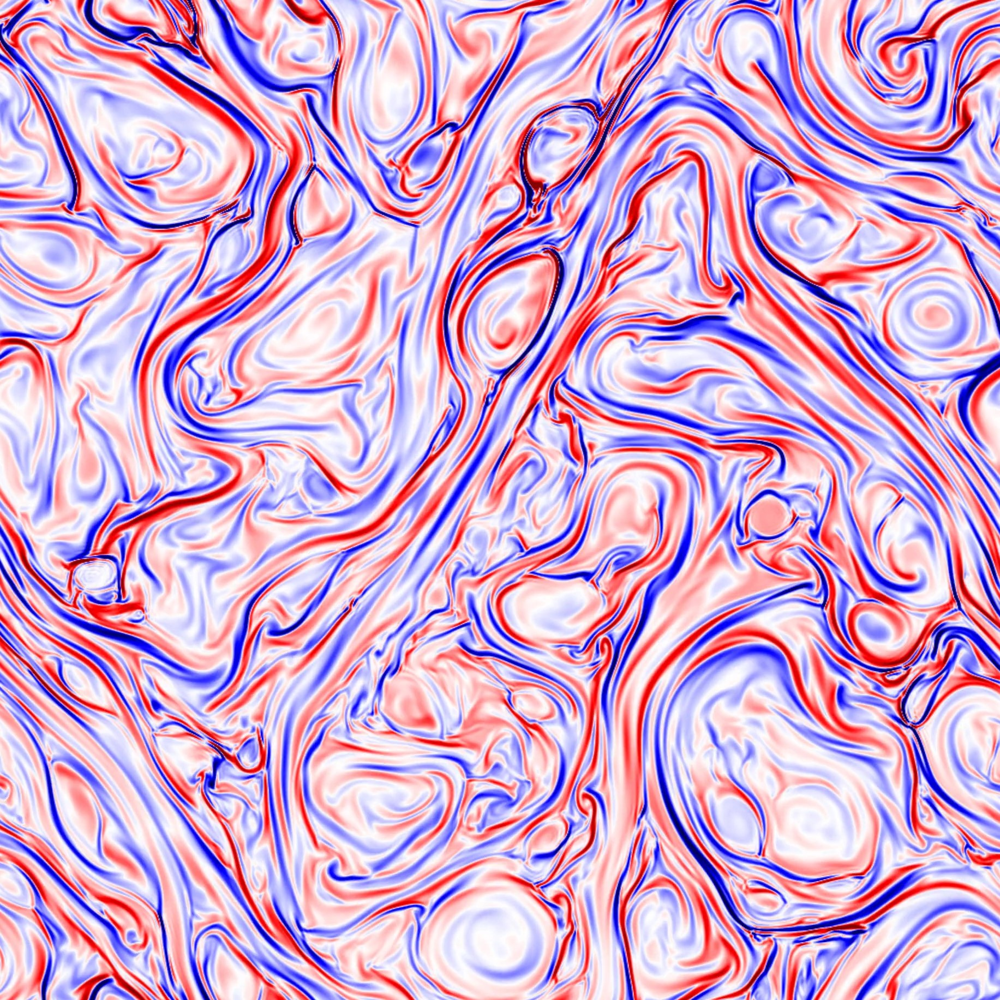

# Quasi-Geostrophic Magnetohydrodynamics

This repository contains codes to study Quasi-Geostrophic Magnetohydrodynamics (QG-MHD). 

By: Jonathan Tessier and Francis J. Poulin

## Nonlinear Evolution

`ParallelShenfun` solves the nonlinear QG-MHD equations formulated for the potential vorticity $q$, and magnetic streamfunction $A$. Assuming an optional stationary background state $(\bar q ,\bar A)$, the code evolves the pertubations $(q' ,A')$, where $q = \bar q + q'$, $A = \bar A + A'$, on a doubly-periodic domain using a pseudo-spectral method with a smooth filter and AB3 timestepping. The code is written in Python and runs in parallel using [Shenfun](https://shenfun.readthedocs.io/en/latest/index.html).

The nonlinear equations read (ignoring diffusion on the background):

   $\partial_t q + {\bf u}  \cdot {\bf \nabla} q =  M^2 {\bf b} \cdot {\bf \nabla}  j + \frac{1}{R_e}\nabla^2(q-\bar q),$

   $\partial _t A + {\bf u} \cdot {\bf \nabla} A  =  \frac{1}{R_m}\nabla^2(A-\bar A),$

where (for a kinetic streamfunction $\psi$, and magnetic streamfunction $A$)

   $q  = \nabla^2 \psi - F^2 \psi, \quad j = \nabla^2 A, \quad {\bf u}  = \hat{z}\cdot\nabla\times \psi, \quad {\bf b}  = \hat{z}\cdot\nabla\times A.$
  
The nondimensional parameters are 

   $F = \frac{L}{R_d}, \quad M = \frac{V_A}{U}, \quad R_e = \frac{\nu}{UL}, \quad R_m = \frac{\kappa}{UL}$,
   
where $R_d=\sqrt{gH}/f$ is the external Rossby radius of deformation and $V_A=B_0/\sqrt{\mu\rho}$ is the Aflvén wave speed, for gravity $g$, mean depth $H$, Coriolis frequency $f$, magnetic field strength ($B_0$), magnetic permeability ($\mu$) and fluid density ($\rho$). $R_e$ and $R_m$ are the hydrodynamic and magnetic Reynolds numbers with viscosity ($\nu$) and magnetic diffusivity ($\kappa$). 

For the original derivation of the dimensional equations, see: [Zeitlin, V. (2013). Remarks on rotating shallow-water magnetohydrodynamics.](https://www.semanticscholar.org/paper/Remarks-on-rotating-shallow-water-Zeitlin/b2b294b16feaafecc4b17926d0128894c8153860)

To turn off the Lorentz force, set $M=0$. $A$ is then a passive tracer advected around by the flow. To consider a rigid lid evolution (equivalent to 2D-MHD), set $F=0$.

## Linear Stability Analysis

`LinearStability` solves the linear stability of parallel shear flows such as a Bickley jet. Linearizing the QG-MHD equations about a background state in geostrophic balance, we neglect the advection of the perturbation by the pertubation but still maintain the advection of the pertrubation by the mean state and the advection of the mean state by the perturbation. Assuming a normal mode decomposition on the perturbations, 
$$\psi' = \hat \psi(y) \exp[i (k x - \omega t)], \quad\quad A' = \hat A(y) \exp[i (k x - \omega t)],$$
we can generate an eigenvalue problem where the eigenvalue $c=\omega/k$ determines the growth rate $\omega_i$ and the phase speed $\omega_r$ of the unstable mode, and the eigenfunctions $(\hat \psi, \hat A)$ show the spatial structure in the y-direction. This transforms the Laplacian operator such that $\hat\nabla^2 = \partial_{yy}-k^2$ and we find the generalized EVP to read (for background velocity $U(y)$ and field $B(y)$ )

$$\begin{bmatrix}
        (U+\frac{i}{k R_e}(\hat\nabla^2 -F))\hat\nabla^2 -U_{yy} & -M^2(B\hat\nabla^2 -B_{yy}) \\
        -B & U+\frac{i}{k R_m}\hat\nabla^2 
    \end{bmatrix}
    \begin{bmatrix}
        \hat\psi  \\
       \hat A  
    \end{bmatrix}
     = c
    \begin{bmatrix}
        \hat\nabla^2 -F & 0 \\
        0 & 1 
    \end{bmatrix}
    \begin{bmatrix}
        \hat\psi  \\
        \hat A 
    \end{bmatrix}.$$

## Examples

Vorticity snapshot of an unstable Bickley jet (without any magnetism).


Vorticity snapshot of decaying 2D-MHD turbulence



## Notes

`Shenfun` Installation: Please see the relevant instructions at [shenfun.readthedocs.io](https://shenfun.readthedocs.io/en/latest/installation.html)

Other Requirements: `numpy`, `scipy`, `pyfftw`, `matplotlib`, `h5py`, `netCDF4`, `mpi4py`, `sys`, `subprocess`, `os`, `time`.

*For `shenfun` install issues on Compute Canada clusters, try:
```
module load python/3.8.10
module load mpi4py
module load fftw-mpi/3.3.8
virtualenv --no-download ENVgit
source ENVgit/bin/activate
pip install --no-index --upgrade pip
pip install --no-index numpy scipy pyfftw cython pyyaml sympy mpi4py_fft numba
git clone https://github.com/spectralDNS/shenfun.git
cd shenfun
python setup.py build install
```
