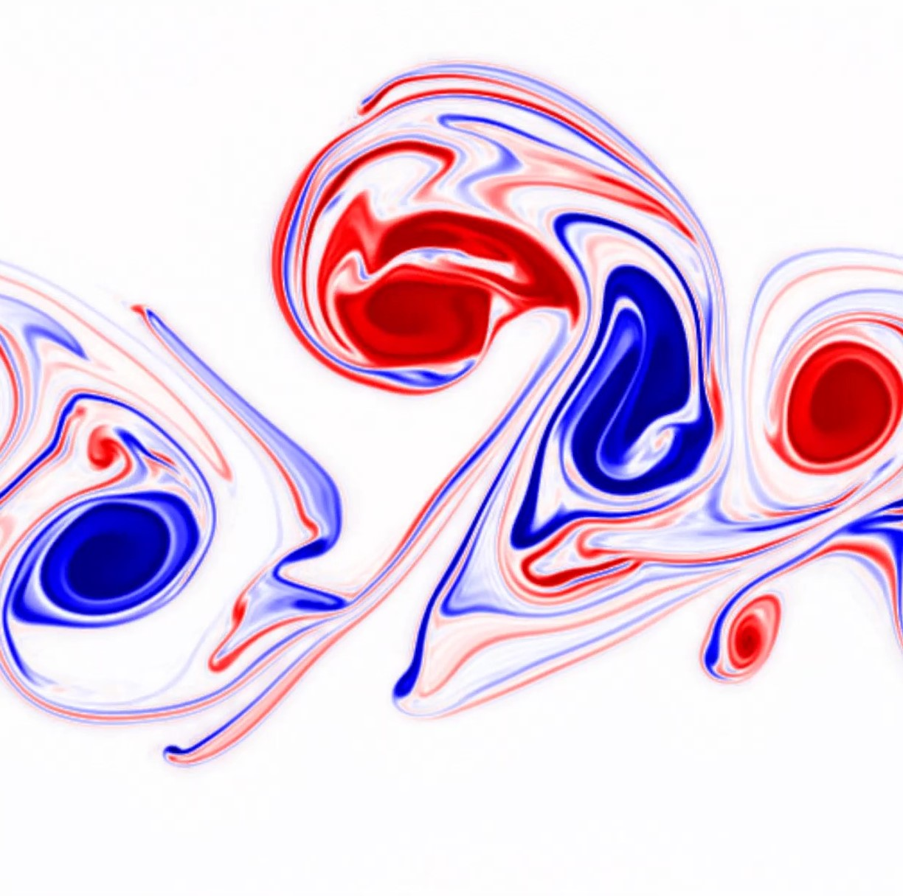

# Nonlinear Quasi-Geostrophic Magnetohydrodynamics

This repository contains a variety of codes to study Magnetohydrodynamics. 

Both `SerialFFTW` and `ParallelShenfun` solve the rotating, incompressible, quasi-geostrophic MHD equations formulated for the potential vorticity $`q`$, and magnetic streamfunction $`A`$, by substracting a stationary background state $`(\bar q ,\bar A)`$ from the fields and evolving their doubly-periodic pertubations $`(q' ,A')`$, where $`q = \bar q + q'`$, $`A = \bar A + A'`$. 
The `SerialFFTW` solves it in serial using [FFTW](https://www.fftw.org/) and `ParallelShenfun` does it in parallel using [Shenfun](https://shenfun.readthedocs.io/en/latest/index.html).

The nonlinear equations read:

   $`\partial_t q + {\bf u}  \cdot {\bf \nabla} q =  M^2 {\bf b} \cdot {\bf \nabla}  \left( \nabla^2 A \right) + \frac{1}{R_e}\nabla^2q,`$

   $`\partial _t A + {\bf u} \cdot {\bf \nabla} A  =  \frac{1}{R_m}\nabla^2A,`$

where (for a velocity streamfunction $`\psi`$, and magnetic streamfunction $`A`$)

   $`q  = \nabla^2 \psi - F^2 \psi, \quad {\bf u}  = \hat{z}\cdot\nabla\times \psi, \quad {\bf b}  = \hat{z}\cdot\nabla\times A.`$
  
The nondimensional parameters are 

   $`F = \frac{L}{R_d}, \quad M = \frac{V}{U}, \quad R_e = \frac{\nu}{UL}, \quad R_m = \frac{\kappa}{UL}`$
   
where $`R_d=\sqrt{gh}/f_0,`$ and $`V=B_0/\sqrt{\mu\rho}`$ are the external Rossby radius of deformation and the Aflvèn wave speed, respectively, for gravity ($`g`$), depth ($`h`$), Coriolis frequency $`f_0`$, magnetic field strength ($`B_0`$), magnetic permeability ($`\mu`$) and fluid density ($`\rho`$). $`R_e`$ and $`R_m`$ are the hydrodynamic and magnetic Reynolds numbers with viscosity ($`\nu`$) and magnetic diffusivity ($`\kappa`$). 

For the original derivation or the dimensional equations, see: [Zeitlin, V. (2013). Remarks on rotating shallow-water magnetohydrodynamics.](https://www.semanticscholar.org/paper/Remarks-on-rotating-shallow-water-Zeitlin/b2b294b16feaafecc4b17926d0128894c8153860)

For no magnetic field, set $`M=0`$. For no free-surface, set $`F=0`$ (length scales much smaller than the radius of deformation).

Perturbations are evolved on a doubly periodic rectangle using a spectral method with a smooth filter and AB3 timestepping.

Example plot: Vorticity snapshot of an unstable Bickley jet (without any magnetism) in the nonlinear regime. 

Example Animation: Vorticity of 2D MHD turbulence

`Shenfun` Installation: Please see the relevant instructions at [shenfun.readthedocs.io](https://shenfun.readthedocs.io/en/latest/installation.html)

Other Requirements: `numpy`, `matplotlib`, `h5py`, `netCDF4`, `mpi4py`, `sys`, `os`, `time`,
